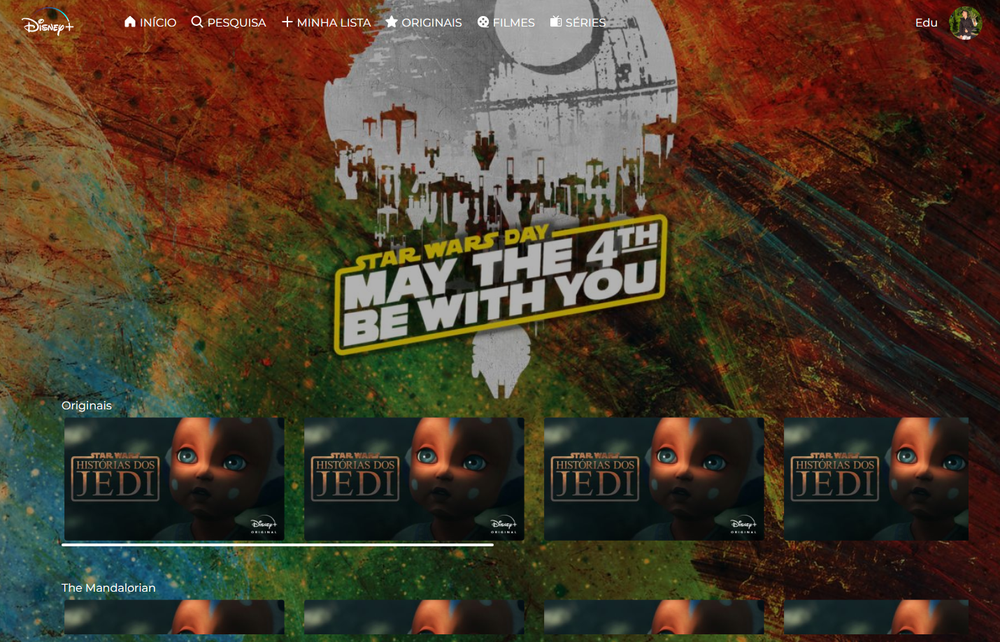

## Disney Plus UI Clone

Clone UI da interface do site da Disney Plus.

> **Note**
> Este projeto teve como foco a prática de conceitos básicos das linguagens utilizadas e não possui as funcionalidades reais e nem um Back-end funcional.

### Descrição:

Desenvolvido para praticar o desenvolvimento web utilizando *React*, bem como a utilização do framework *Tailwind*

### Tech stack:

- HTML, JavaScript e CSS 
- [React JS](https://react.dev)
- [Git/GitHub](https://git-scm.com)

### Preview:

<p align="center">
  
</p>

### Dependências utilizadas:

- [Tailwind](https://tailwindcss.com)

### Uso:

Você pode clonar o projeto e instalar suas dependências através dos seguintes comandos:


```sh
git clone https://github.com/EduVieira131/DisneyPlus-UI-Clone
cd DisneyPlus-UI-Clone
npm install
```
